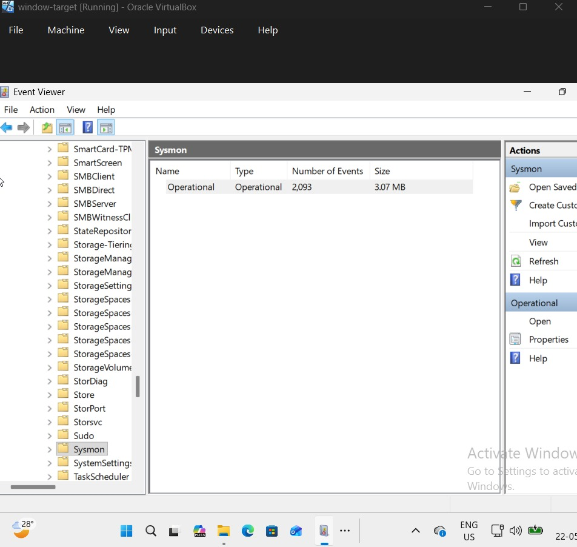
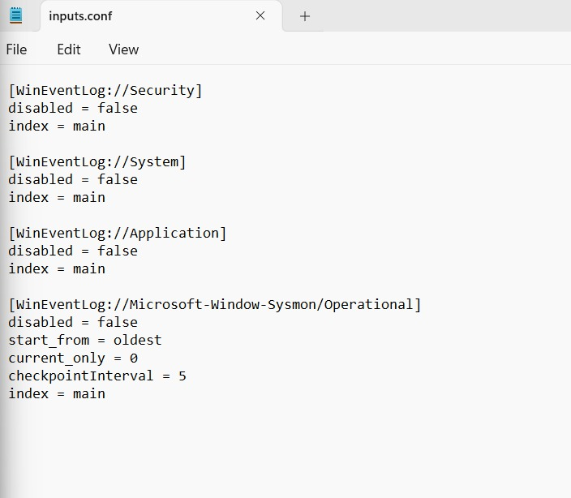
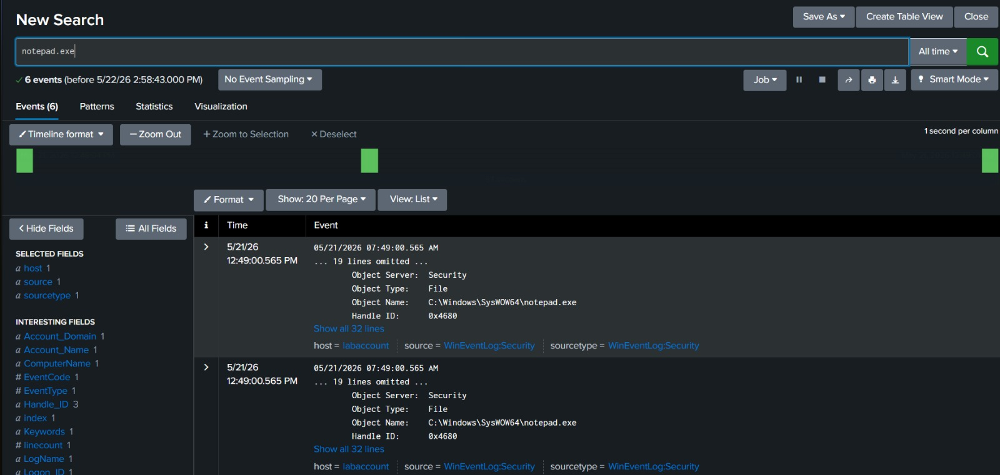
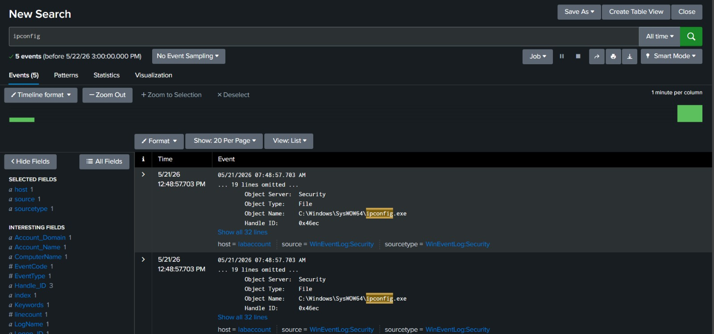
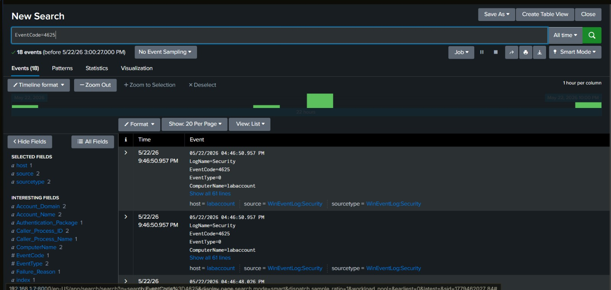

# Windows Endpoint Monitoring with Sysmon and Splunk

## Project Overview

This project demonstrates endpoint monitoring and security event analysis using Sysmon and Splunk Enterprise.

A Windows virtual machine was configured with Sysmon to generate detailed endpoint telemetry. Splunk Universal Forwarder was used to collect Windows Security, System, Application, and Sysmon logs and forward them to Splunk Enterprise for centralized monitoring and investigation.

The lab was used to monitor process execution activity, analyze Windows security events, and investigate failed authentication attempts.

---

## Technologies Used

- Splunk Enterprise
- Sysmon
- Splunk Universal Forwarder
- Windows 11
- Windows Event Logs
- VirtualBox

---

## Lab Setup

- Ubuntu virtual machine running Splunk Enterprise
- Windows virtual machine running Sysmon
- Splunk Universal Forwarder configured on Windows
- Security, System, Application, and Sysmon logs forwarded to Splunk

---

## Sysmon Configuration

Sysmon was installed and configured on the Windows endpoint to generate detailed security telemetry and process activity logs.

---

## Splunk Forwarder Configuration

The Splunk Universal Forwarder was configured using inputs.conf to collect Windows Event Logs and Sysmon Operational logs for analysis in Splunk Enterprise.

---

## Process Monitoring and Analysis

Process execution activity was monitored using Sysmon telemetry and analyzed through Splunk searches.

Examples included monitoring execution of commands such as:

- ipconfig.exe
- notepad.exe

---

## Authentication Failure Monitoring

Windows Security Event ID 4625 was analyzed to identify failed login attempts and authentication failures.

---

## Key Skills Demonstrated

- Security Information and Event Management (SIEM)
- Splunk Search Processing Language (SPL)
- Sysmon Configuration and Monitoring
- Windows Event Log Analysis
- Endpoint Monitoring
- Threat Detection
- Log Analysis
- Security Monitoring
- Authentication Monitoring
- Incident Investigation
- SOC Operations

---

## Project Outcome

Successfully deployed a Windows endpoint monitoring lab capable of collecting, forwarding, and analyzing endpoint telemetry and Windows security events using Sysmon and Splunk Enterprise. The project demonstrates practical SOC analyst skills including log analysis, threat detection, authentication monitoring, and security event investigation.
